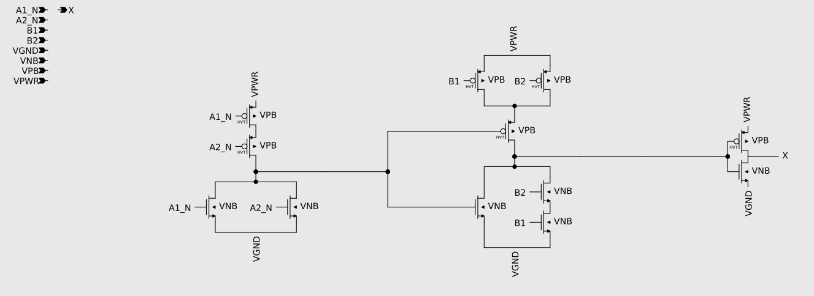

# spice2sch

A CLI to convert SkyWater SKY130 spice files into xschem .sch files. Designed for [sifferman/sky130_schematics](https://github.com/sifferman/sky130_schematics). Available from [PyPI](https://pypi.org/project/spice2sch/).

## Use without installing

### For uv users
```bash
uvx spice2sch -h
```

## Installation

### For uv users (recommended)

```bash
uv tool install spice2sch
```

### For pip users

```bash
pip install spice2sch
```

## Usage

> [!CAUTION]
> The output file will be overwritten without warning.

Specify and input .spice and and output .sch file.

```bash
spice2sch -i file.spice -o file.sch
```

Input and output will default to stdin and stdout making this equivalent to the above command:

```bash
cat file.spice | spice2sch > file.sch
```

## Example

1. Generate a sch file. The following command uses uvx to use the package without downloading, and pipes a spice netlist from the clipboard to the tool.

```bash
wl-paste | uvx spice2sch -o sky130_fd_sc_hd__a2bb2o_1.sch
```

2. After running tool:
   

## Limitations

- All devices (transistors, resistors, diodes, …) are placed by looking up xschem symbols under `PDK_ROOT` (`--pdk-root` or the `PDK_ROOT` env var), so a PDK root is required for any design with devices. Any PDK laid out the open_pdks way (`<variant>/libs.tech/xschem/<library>/*.sym`, with SPICE subckt refs of the form `<library>__<model>`) is supported, not just SkyWater SKY130.
- Hierarchical standard-cell instances (e.g. `macro_sparecell`) are not expanded.
- Although schematics will pass a Layout Versus Schematic (LVS) check, the automatic placement is only a starting point. Gates are drawn as wired pull-up/pull-down networks and laid out left to right by signal flow, with wires between neighboring stages; longer-range nets, feedback, rails, and ports are still connected by net labels, so larger cells usually still need some manual tidying.

## Running from source with uv

Clone the repo

```bash
git clone git@github.com:eliahreeves/spice2sch.git
cd spice2sch
```

Build and run

```bash
uv run spice2sch
```

> [!NOTE]
> You may need to remove existing installations using `uv tool uninstall spice2sch` or similar in order to avoid namespace confilcts.

To run tests optionally use `nix develop` and run `make test-full`.